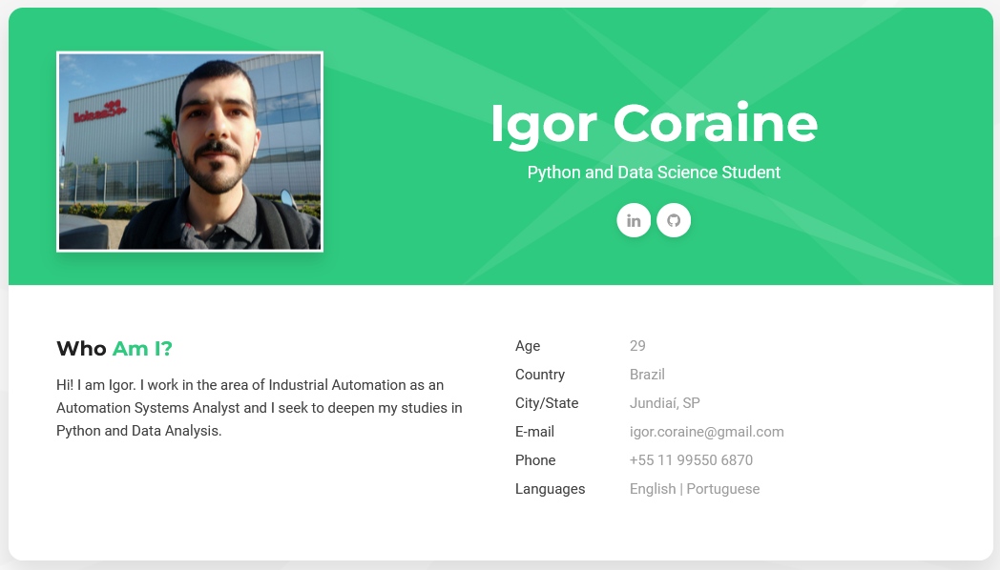

# My Online CV

> This is a website to be used as a online CV and portifolio.

The project uses HTML, CSS and JS to build a static website to be used as a online curriculum. 
- It has a *Home* page with a presentation;
- A page *Curriculum* with the education and professional experience information;
- And one page *Portifolio* with some projects linked to its Github pages.

# Access

The website can be reached at <https://igorcoraine.github.io>
